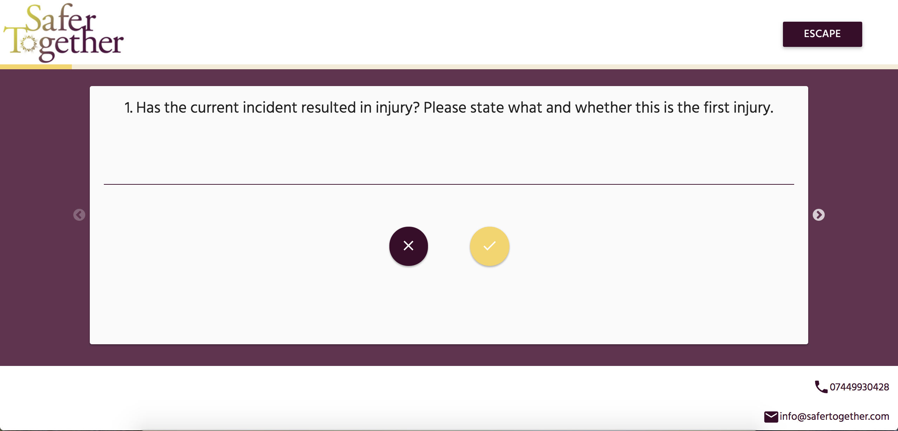

# Web Development Portfolio: Bradley Reeder

## Skills

| Languages | Frameworks/Libraries | Testing   | Tools/Others | Databases                  | Methodologies |
|:---------:|:--------------------:|:---------:|:------------:|:--------------------------:|:-------------------------:|
| Javascript| Hapi.js (REST APIs)              | Tape/Tap  | Git/ Github  | PostgreSQL                 | Agile |
| Node.js   | React.js             | QUnit     | Linux CL     | Redis                      | UCD |
| HTML5     | jQuery               | Jasmine   | npm          | Service Workers | Acccessibility |
| CSS3, Sass| Bootstrap            | TravisCI  | Heroku       |                            | TDD |
| Markdown  | Materialize          |           | Handlebars   |                            | User Testing |
| SQL       |                      |           |  Figma + InVision            |    | Pair Programming |

---

## Client Projects

### Downing LLP ([Website](https://www.downing.co.uk/))

I worked with Downing LLP as a front-end (UI) developer on a contract basis. My responsibilities included debugging, refactoring and maintaining the code and assets on their new website for their crowdfunding platform. As a part of the role, I helped mentor junior members of their front-end team.

**Tech Stack:** HTML5, CSS3, LESS, Javascript (ES5/6), jQuery, Bootstrap, Angular.js, TypeScript

**Co-Developers:** Downing LLP's Engineering Team

  

---

### Anna Freud Centre

I facilitated hackathons, design sprints, usability testing, and training workshops on agile and design thinking methodologies for the Anna Freud Centre - a charity that provides support & training for child mental health services.

As a part of this, I scrum-mastered the agile process for their products **Grow** ([Website](https://growgoals.co.uk/login) | [Source Code](https://github.com/CYPIAPT-LNDSE/goals-app)) and **Getting to Know You** ([Website](https://welcome-in.herokuapp.com/) | [Source Code](https://github.com/CYPIAPT-LNDSE/welcome-to-camhs)) and developed their product **Breathe With Me**.

  
  
  

### Breathe With Me ([Website](https://breathewithme.co.uk/) | [Source Code](https://github.com/CYPIAPT-LNDSE/Breathe-With-Me))

I worked in a small team building a progressive web application aimed at young people with generalised anxiety disorders. The app improves resilience from stress by guiding the user through breathing and relaxation techniques, demonstrated using SVG and Greensock.js animations. The app is offline-first, accessible, responsive across devices, and supported across browsers. It is architected using a custom View-Controller Design Pattern.

The app originated from a design sprint we facilitated and we regularly usability tested it with young people in services throughout each build sprint.

**Tech Stack**: HTML5, CSS3, SASS, SVG, Javasript (ES6), Greensock.js, Service Workers (PWA), App Cache, Web Pack

**Co-Developers:** [Sofia Pohjalainen](https://github.com/sofiapoh) | [Noga Inbar](https://github.com/nogainbar) | [Kara de la Marck](https://github.com/MarckK) | [Gabriel Perales](https://github.com/gabrielperales)

  
  
  

---

### CAST

I facilitated design sprints and usability testing as a part of CAST’s 2016 Digital Fellowship programme, which trains charities in digital services. As a part of this I built high fidelity prototypes for:

### Worthwhile ([Website](http://worthwhile-contract-manager.herokuapp.com/) | [Source Code](https://github.com/worthwhile-charity/hack-day))

We built a prototype that automates the process of generating and issuing contracts and invoices for clients who find a job through the charity, Worthwhile.

**Tech Stack**: HTML5, CSS3, Javascript (ES6), Materialize, Node.js, Hapi.js, Handlebars.js, Heroku

**Co-Developers**: [Matthew Glover](https://github.com/matthewglover) | [Troy Maeder](https://github.com/TroyMaeder) | [Mattia Spinelli](https://github.com/daymos)

### SaferTogether ([Website](https://safertogether.github.io/saferTogether/) | [Source Code](https://github.com/saferTogether/saferTogether))

We built a risk assessment survey targeted at victims of domestic abuse. As a project manager, my additional responsibilities included managing communications with the product owners, guiding them through user testing, and ensuring agile practices were followed.

**Tech Stack**: HTML5, CSS3, Javascript (ES5), Materialize

**Co-Developers**: [Sofia Pohjalainen](https://github.com/sofiapoh)

  
  
  

---

## Client Workshops

I have experience facilitating and delivering a 4 month web development programme for the bootcamp [Founders & Coders](https://foundersandcoders.com/). I have a lot of experience designing, user testing, and iteratively improving workshops:

* [**Intro to Node**](https://github.com/foundersandcoders/Node-Intro-Workshop) -- Currently used as the introductory workshop to node.js at the Founders & Coders bootcamp.

* [**Node Shell**](https://github.com/foundersandcoders/Node-Shell-Workshop) -- An introductory workshop to node.js and shell scripting, culminating in building a small command-line tool.

* [**UX Design & Agile Methodologies**](https://github.com/foundersandcoders/master-reference/tree/master/coursebook/weeks-10-12) -- Co-designed weeks 10-12 of the Founders & Coders bootcamp. Students take their own final project ideas through the UX Design process of user research, rapid prototyping, and usability testing and then build them following the Scrum methodology.

* [**Design Sprints**](https://docs.google.com/presentation/d/1GdD6KVaRyf1VuzzSS0-LUoNITjtjr38hhbn2YeF2NO4/edit) -- Facilitated hackathons and design sprints using slidedecks such as this.

* [**Design Thinking**](https://docs.google.com/presentation/d/1pXw-1476S-CM776Kh3TAlHqUmA79AS3XezpHm9BECWY/edit#slide=id.gc6f73a04f_0_0) -- Trained Anna Freud staff and young people in the design thinking methodology of inspiration, ideation, and implementation.

## Personal Projects

*Note: With the exception of my personal website, the following projects were built in 2-3 days, as learning exercises to implement studied technologies, and not with the intent of building commercial products. These projects were built in teams of 2 or 4 people (using pair programming), and so include other people's work.*

### Professional Portfolio ([Website](https://bradreeder.github.io/) | [Source Code](https://github.com/bradreeder/bradreeder.github.io))

As a contractor I have taken on a growing number of small UX Research & Service Design projects. This website was built as a single-page application using react.js as a client-facing portfolio for my UX experience. It is accessible and responsive across browsers and devices.

**Tech Stack:** HTML5, CSS3, SASS, Javascript (ES6), React.js, Webpack, Github Pages

  

---

### Tile Game ([Website](https://evening-reef-36937.herokuapp.com/) | [Source Code](https://github.com/bradreeder/Tile-game))

A retro recreation of some of the puzzles from the popular video game franchise [The Legend of Zelda](https://en.wikipedia.org/wiki/The_Legend_of_Zelda). Used to learn TDD (with Tape & TravisCI) and the Module design pattern.

Use the directional arrows on your keyboard to play and enter to refresh the game. The aim is to traverse every purple tile on the board without stepping on the same tile twice. There are multiple levels that increase in difficulty.

**Tech Stack:** HTML5, CSS3, Javascript (ES5), Node.js, Tape, TravisCI, Istanbul, CodeCov, Heroku

  

---

### Autocomplete ([Website](https://mighty-refuge-83559.herokuapp.com/public/origami.html) | [Source Code](https://github.com/FloatingIntegers/autocomplete-app))

An autocomplete application that returns the closest 10 word matches of a string entered into a form input field and updates as you type. The origami animations are implemented using a css library called [OriDomi](http://oridomi.com/).

**Tech Stack:** HTML5, CSS3, Javascript (ES5/6), Node.js, Tape, TravisCI, Istanbul, CodeCov, eslint, Heroku

  

---

### Twitterish ([Website](https://hidden-forest-53528.herokuapp.com/) | [Source Code](https://github.com/FloatingIntegers/twitterish))

A twitter-like dashboard for sharing thoughts in under 140 characters. The source code for another version of this project, including session management with cookies and postgreSQL as database, can be found [here](https://github.com/FloatingIntegers/twitterish2.0).

**Tech Stack**: HTML5, CSS3, Javascript (ES5/6), Node.js, Karma, Tape, Redis, Socket.io, PostgreSQL, Heroku

  

---

### CMS ([Source Code](https://github.com/Hapi-Hapi-Joy-Joy/CMS))

A basic content management system for posting and retrieving blog posts using hapi.js as a backend framework and PostgreSQL as a database. Also used this project to learn the stylesheet language Sass.

**Tech Stack**: HTML5, CSS3, SASS, Javascript (ES5/6), Node.js, Hapi.js, PostgreSQL, Tape

  

---
